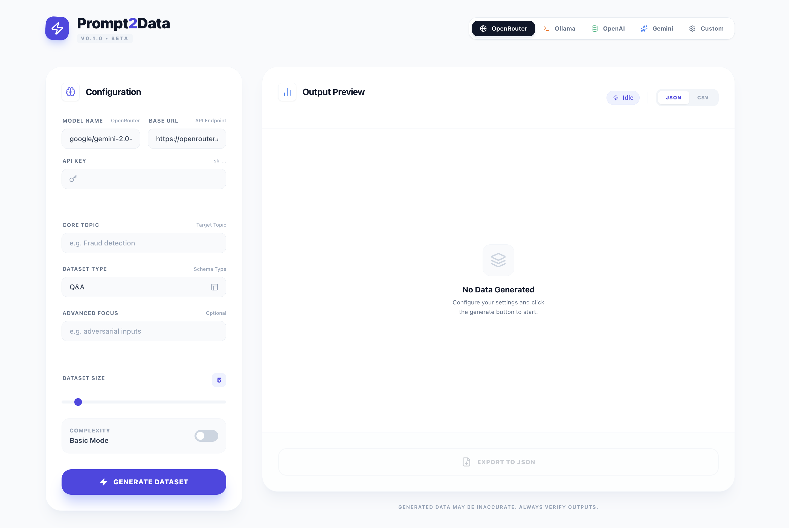
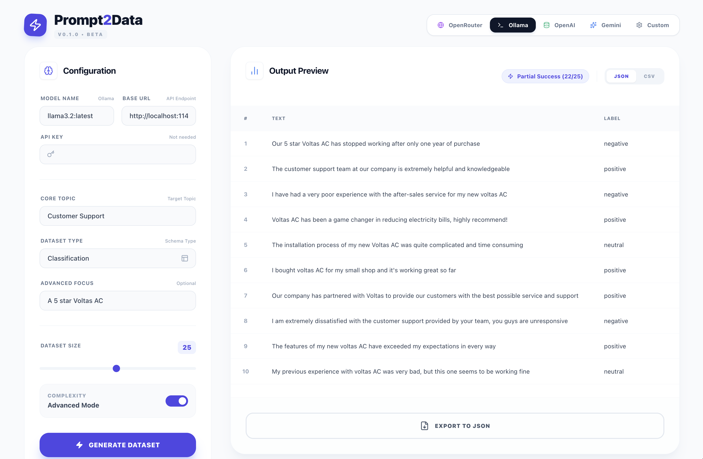

# Prompt2Data

<p align="center">
  
</p>

<p align="center">
  <strong>Generate high-quality synthetic datasets from simple text prompts.</strong>
</p>

---

Prompt2Data is a powerful, intuitive web application that allows you to generate synthetic datasets for various machine learning tasks using a wide range of large language models (LLMs). Simply provide a topic, choose your dataset type and model provider, and let the magic happen.

## Features

- **Multiple Dataset Types**: Generate data for Q&A, Summarization, Classification, and Text Generation tasks.
- **Flexible Model Integration**:
  - **OpenRouter**: Access a wide variety of models from different providers.
  - **Ollama**: Connect to your local LLMs running via Ollama.
  - **OpenAI**: Use models directly from OpenAI (e.g., GPT-4o, GPT-3.5).
  - **Google Gemini**: Leverage Google's powerful Gemini models.
  - **Custom**: Configure any other OpenAI-compatible API endpoint.
- **Advanced Generation**:
  - **Basic & Advanced Modes**: Control the complexity and nuance of the generated data.
  - **Focus Control**: Guide the model with specific constraints or edge cases to focus on.
- **Customizable Output**:
  - Set the desired dataset size.
  - Export your generated data in both **JSON** and **CSV** formats.
- **Responsive UI**: A clean, modern, and responsive interface that works on any device.

## Screenshots

<p align="center">
  
  
</p>

## Getting Started

Follow these steps to get the project running on your local machine.

### Prerequisites

- [Node.js](https://nodejs.org/) (v18 or higher recommended)
- [npm](https://www.npmjs.com/) or a compatible package manager

### Installation

1. **Clone the repository:**

    ```bash
    git clone https://github.com/your-username/prompt-2-data.git
    cd prompt-2-data
    ```

2. **Install dependencies:**

    ```bash
    npm install
    ```

3. **Set up environment variables:**

    Create a `.env` file in the root of the project by copying the example file:

    ```bash
    cp .env.example .env
    ```

    Open the `.env` file and add your API keys for the services you want to use:

    ```
    VITE_OPENROUTER_API_KEY="your_openrouter_api_key"
    VITE_OPENAI_API_KEY="your_openai_api_key"
    VITE_GEMINI_API_KEY="your_gemini_api_key"
    ```

    The application will automatically pick up these keys when you select the corresponding provider.

## Usage

To start the development server, run the following command:

```bash
npm run dev
```

This will start the application, and you can access it in your browser at `http://localhost:5173` (or another port if 5173 is in use).

## How It Works

1. **Configure**:
    - Select a **Provider** (e.g., OpenRouter, Ollama).
    - The Model Name, Base URL, and API Key fields will be pre-filled with defaults. Adjust them if needed. For Ollama, no API key is required.
2. **Define**:
    - Enter a **Core Topic** for your dataset (e.g., "Customer reviews for a coffee shop").
    - Choose a **Dataset Type** (e.g., Classification).
    - Optionally, add an **Advanced Focus** to guide the generation (e.g., "focus on ambiguous or sarcastic reviews").
3. **Generate**:
    - Adjust the **Dataset Size** and **Complexity Mode**.
    - Click the **"GENERATE DATASET"** button.
4. **Preview & Export**:
    - The generated data will appear in the **Output Preview** table.
    - Choose your desired format (JSON or CSV) and click the **"Export"** button to download the file.

## Example Output

Here are small examples of what the generated files look like.

### JSON Example (`qa_example.json`)

```json
[
  {
    "question": "What is the capital of France?",
    "answer": "The capital of France is Paris."
  },
  {
    "question": "What is the main component of Earth's atmosphere?",
    "answer": "The main component of Earth's atmosphere is nitrogen, which makes up about 78% of the air."
  }
]
```

### CSV Example (`qa_example.csv`)

```csv
"question","answer"
"What is the capital of France?","The capital of France is Paris."
"What is the main component of Earth's atmosphere?","The main component of Earth's atmosphere is nitrogen, which makes up about 78% of the air."
```

---

_This project was built with Vite, React, and Tailwind CSS._

---

_This project was built with Vite, React, and Tailwind CSS._
